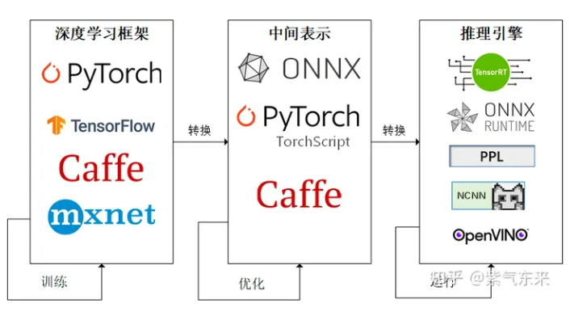

# 知识点

# 使用python-onnxruntime
1. 导出onnx模型`bash export-yolov5-6.0.sh`
2. 执行`python inference-with-onnxruntime.py`
3. 结果在workspace下python-ort.jpg

# 使用c++-onnxruntime
1. 导出onnx模型`bash export-yolov5-6.0.sh`
2. 编译运行`make run`

=============================================================
## OnnxRuntime, TensorRT 和 OpenVINO比较

在得到ONNX（Open Neural Network Exchange）模型后，使用ONNX Runtime和TensorRT进行推理性能的比较，取决于多个因素，包括硬件配置、模型复杂性、优化级别和特定的操作实现。下面是一个简要的比较和解释。

### ONNX Runtime

ONNX Runtime是一个用于执行机器学习模型的性能优化的推理引擎。它支持多种硬件和平台，提供了对ONNX模型的广泛支持，并能够在不同的设备上执行，包括CPU和GPU。ONNX Runtime通过图优化、内核融合等技术来提高推理性能，而且它的设计目标是提供跨平台的高性能推理能力。

### TensorRT

TensorRT是NVIDIA提供的一个深度学习推理引擎，专门针对NVIDIA GPU进行了优化。它通过层和张量融合、内核自动调整、精度校准（如FP16和INT8量化）等技术，来大幅度提高推理速度和效率，同时减少模型的内存占用。TensorRT特别适合用在需要高吞吐量和低延迟的应用场景中，如实时视频处理和自动驾驶等。

### 性能比较

1. **硬件加速**：如果你使用的是NVIDIA GPU，TensorRT通常会提供更好的性能。这是因为TensorRT专门为NVIDIA的硬件设计，能够充分利用GPU的计算能力。

2. **模型优化和量化**：TensorRT提供了更多的模型优化选项和量化策略，这可以进一步提高推理速度并降低模型大小。ONNX Runtime也支持一些优化，但在针对NVIDIA GPU的优化方面，TensorRT可能会更加出色。

3. **跨平台支持**：如果推理需要在不同的硬件或没有NVIDIA GPU的环境下执行，ONNX Runtime可能是一个更灵活的选择，因为它支持更广泛的平台和硬件。

总的来说，如果推理环境中包含NVIDIA GPU，且对推理速度和效率有较高要求，TensorRT通常会提供更好的性能。但如果应用场景需要跨平台支持或者在非NVIDIA硬件上运行，ONNX Runtime可能是更合适的选择。在实际应用中，最好的做法是根据你的具体需求和环境，对两种引擎进行实际的性能测试，以确定最适合你项目的选择。

OpenVINO（Open Visual Inference and Neural network Optimization）是英特尔推出的一个开源工具套件，旨在加速深度学习模型的部署和推理过程，特别是针对视觉相关的任务。OpenVINO提供了一系列优化工具和库，能够在英特尔的各种硬件（包括CPU、集成GPU、FPGA和VPU等）上实现高效的推理性能。

### 与ONNX Runtime和TensorRT的比较

1. **硬件支持**：
   - OpenVINO主要针对英特尔的硬件平台进行优化，包括但不限于Intel CPUs、GPUs、FPGAs和VPUs（如Movidius神经计算棒）。这意味着如果你的部署环境主要是基于英特尔硬件的，使用OpenVINO可能会获得更好的性能。
   - ONNX Runtime支持多种硬件和平台，包括CPU和GPU，但它的GPU支持主要是针对NVIDIA GPUs。
   - TensorRT是专门为NVIDIA GPU优化的，提供了非常高效的推理性能，尤其是在使用NVIDIA GPU时。

2. **模型优化**：
   - OpenVINO包括了一个模型优化器，可以将不同来源的模型（包括TensorFlow, PyTorch, ONNX等）转换为其内部格式（Intermediate Representation, IR），进行深度优化以适应英特尔硬件。
   - TensorRT同样提供了深度优化和加速功能，特别是在模型量化、层融合等方面。
   - ONNX Runtime提供了一定程度的模型优化能力，但可能不如专门针对特定硬件优化的引擎那样深入。

3. **适用场景**：
   - OpenVINO特别适合于视觉相关的深度学习应用，如视频分析、图像处理和人脸识别等，在这些领域它能提供出色的性能和灵活的硬件支持。
   - TensorRT优势在于高效的NVIDIA GPU上的推理性能，适用于需要高吞吐量和低延迟的场景。
   - ONNX Runtime则提供了一种更为通用的解决方案，支持广泛的模型和硬件，适合需要跨平台部署的应用。

总的来说，OpenVINO、ONNX Runtime和TensorRT各有其优势和特定的应用场景。选择哪一个取决于你的具体需求、目标硬件平台以及模型的特点。在实践中，最好基于实际的性能测试来做出选择，以确保选用的推理引擎能够满足项目的性能和精度要求。

