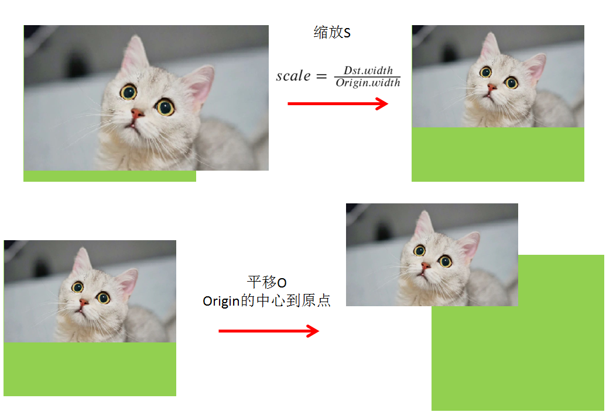

# 知识点
1. yolov5的预处理部分，使用了仿射变换，请参照仿射变换原理
    - letterbox采用双线性插值对图像进行resize，并且使源图像和目标图像几何中心的对齐
        
    - 使用仿射变换实现letterbox的理由是
        - 1. 便于操作，得到变换矩阵即可
        - 2. 便于逆操作，实则是逆矩阵映射即可
        - 3. 便于cuda加速，cuda版本的加速已经在cuda系列中提到了warpaffine实现
            - 该加速可以允许warpaffine、normalize、除以255、减均值除以标准差、变换RB通道等等在一个核中实现，性能最好
2. 后处理部分，反算到图像坐标，实际上是乘以逆矩阵
    - 而由于逆矩阵实际上有效自由度是3，也就是d2i中只有3个数是不同的，其他都一样。也因此你看到的是d2i[0]、d2i[2]、d2i[5]在作用


# 运行步骤
1. 导出onnx模型
    - `bash export-yolov5-6.0.sh`
    - 脚本中会把模型文件移动到workspace/yolov5s.onnx下
2. 运行编译和推理
    - `make run -j64`

# 使用pytorch的yolov5进行导出
- 运行`bash detect-for-yolov5-6.0.sh`

# 修改过的地方：
```python
# line 55 forward function in yolov5/models/yolo.py 
# bs, _, ny, nx = x[i].shape  # x(bs,255,20,20) to x(bs,3,20,20,85)
# x[i] = x[i].view(bs, self.na, self.no, ny, nx).permute(0, 1, 3, 4, 2).contiguous()
# modified into:

bs, _, ny, nx = x[i].shape  # x(bs,255,20,20) to x(bs,3,20,20,85)
bs = -1
ny = int(ny)
nx = int(nx)
x[i] = x[i].view(bs, self.na, self.no, ny, nx).permute(0, 1, 3, 4, 2).contiguous()

# line 70 in yolov5/models/yolo.py
#  z.append(y.view(bs, -1, self.no))
# modified into：
z.append(y.view(bs, self.na * ny * nx, self.no))

############# for yolov5-6.0 #####################
# line 65 in yolov5/models/yolo.py
# if self.grid[i].shape[2:4] != x[i].shape[2:4] or self.onnx_dynamic:
#    self.grid[i], self.anchor_grid[i] = self._make_grid(nx, ny, i)
# modified into:
if self.grid[i].shape[2:4] != x[i].shape[2:4] or self.onnx_dynamic:
    self.grid[i], self.anchor_grid[i] = self._make_grid(nx, ny, i)

# disconnect for pytorch trace
anchor_grid = (self.anchors[i].clone() * self.stride[i]).view(1, -1, 1, 1, 2)

# line 70 in yolov5/models/yolo.py
# y[..., 2:4] = (y[..., 2:4] * 2) ** 2 * self.anchor_grid[i]  # wh
# modified into:
y[..., 2:4] = (y[..., 2:4] * 2) ** 2 * anchor_grid  # wh

# line 73 in yolov5/models/yolo.py
# wh = (y[..., 2:4] * 2) ** 2 * self.anchor_grid[i]  # wh
# modified into:
wh = (y[..., 2:4] * 2) ** 2 * anchor_grid  # wh
############# for yolov5-6.0 #####################

# line 77 in yolov5/models/yolo.py
# return x if self.training else (torch.cat(z, 1), x)
# modified into:
return x if self.training else torch.cat(z, 1)

# line 52 in yolov5/export.py
# torch.onnx.export(dynamic_axes={'images': {0: 'batch', 2: 'height', 3: 'width'},  # shape(1,3,640,640)
#                                'output': {0: 'batch', 1: 'anchors'}  # shape(1,25200,85)  修改为
# modified into:
torch.onnx.export(dynamic_axes={'images': {0: 'batch'},  # shape(1,3,640,640)
                                'output': {0: 'batch'}  # shape(1,25200,85) 
```

# Reference
- https://github.com/shouxieai/tensorRT_Pro

=========================================================================
## 有关 vector 的 emplace_back 和 push_back 的使用时机

在C++中，`std::vector`是一种非常常用的动态数组容器，它提供了`push_back`和`emplace_back`两种方法来添加新元素。这两个函数都是用于在`vector`的末尾插入新元素，但它们在插入新元素时的行为和效率方面有所不同。

### push_back
- `push_back`用于在`vector`的末尾添加一个元素。
- 它会将传入的元素作为参数，如果这个元素是一个对象，`push_back`会复制或移动这个对象到容器的末尾。
- 使用`push_back`时，如果传入的是一个临时对象或可以被移动的对象，这可能会引发一次或两次构造函数调用加上一次或两次析构函数调用。首先是创建临时对象的构造函数调用，然后是将临时对象复制或移动到容器中的构造函数调用，最后是临时对象的析构函数调用。

### emplace_back
- `emplace_back`是C++11引入的，它允许在容器的末尾直接构造元素，避免了额外的复制或移动操作。
- 它接受的参数是用于构造新元素的构造函数的参数，而不是新元素本身。`emplace_back`会根据这些参数在`vector`的末尾原地构造元素。
- 使用`emplace_back`可以减少不必要的对象复制和移动，提高效率，特别是当添加到容器的对象包含复杂资源，如动态分配的内存时。

### 何时使用哪个？
- **使用`push_back`**：当你已经有一个对象实例，并想要添加到`vector`中时。如果你传递的是一个右值（比如临时对象），编译器很可能会优化这个操作，通过移动语义避免复制。
- **使用`emplace_back`**：当你想要直接在容器中构造对象，避免额外的复制或移动操作时。这对于提高效率尤其重要，尤其是在添加的对象类型没有定义移动语义，或者包含指针、动态分配的内存等资源时。

简而言之，如果你可以直接在容器末尾构造对象，那么`emplace_back`通常是更优的选择。但是，如果你已经有一个对象并且想把它添加到容器中，使用`push_back`可能更直接一些。在性能敏感的应用中，合理选择两者中的一个可以帮助优化性能。