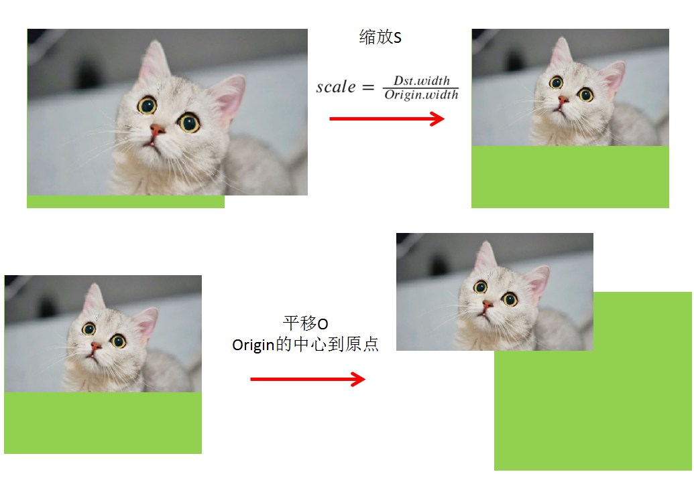

# 关于OpenVINO
1. 步骤：
    - 通过model = core.compile_model(xx.onnx)编译模型
    - 通过iq = model.create_infer_request()创建推理请求
    - input = iq.get_input_tensor(0);获取输入的tensor
    - output = iq.get_output_tensor(0);获取输出的tensor
    - input.set_shape({input_batch, input_channel, input_height, input_width});配置输入大小，因为是动态batch，需要先设置大小，此时会分配空间
    - input_data_host = input.data<float>();获取输入指针，必须set shape后才能获取数据指针，否则会存储空间没分配而异常
    - 把图像预处理并储存到 input_data_host
    - iq.infer() 执行推理步骤
    - output_data_host = output.data<float>();通过output拿到推理后的输出
    - 对output data进行解码得到最后的输出框

# 知识点
1. yolov5的预处理部分，使用了仿射变换，请参照仿射变换原理
    - letterbox采用双线性插值对图像进行resize，并且使源图像和目标图像几何中心的对齐
        
    - 使用仿射变换实现letterbox的理由是
        - 1. 便于操作，得到变换矩阵即可
        - 2. 便于逆操作，实则是逆矩阵映射即可
        - 3. 便于cuda加速，cuda版本的加速已经在cuda系列中提到了warpaffine实现
            - 该加速可以允许warpaffine、normalize、除以255、减均值除以标准差、变换RB通道等等在一个核中实现，性能最好
2. 后处理部分，反算到图像坐标，实际上是乘以逆矩阵
    - 而由于逆矩阵实际上有效自由度是3，也就是d2i中只有3个数是不同的，其他都一样。也因此你看到的是d2i[0]、d2i[2]、d2i[5]在作用


# 运行步骤
1. 导出onnx模型
    - `bash export-yolov5-6.0.sh`
    - 脚本中会把模型文件移动到workspace/yolov5s.onnx下
2. 安装openvino
    - 如果直接`make run`可以运行，则启动成功，如果失败，请安装openvino后修改Makefile中openvino路径后再运行
    - `bash l_openvino_toolkit_p_2022.1.0.643_offline.shx`
3. 运行编译和推理
    - `make run`

# 使用pytorch的yolov5进行导出
- 运行`bash detect-for-yolov5-6.0-change.sh`

# 修改过的地方：
```python
# line 55 forward function in yolov5/models/yolo.py 
# bs, _, ny, nx = x[i].shape  # x(bs,255,20,20) to x(bs,3,20,20,85)
# x[i] = x[i].view(bs, self.na, self.no, ny, nx).permute(0, 1, 3, 4, 2).contiguous()
# modified into:

bs, _, ny, nx = x[i].shape  # x(bs,255,20,20) to x(bs,3,20,20,85)
bs = -1
ny = int(ny)
nx = int(nx)
x[i] = x[i].view(bs, self.na, self.no, ny, nx).permute(0, 1, 3, 4, 2).contiguous()

# line 70 in yolov5/models/yolo.py
#  z.append(y.view(bs, -1, self.no))
# modified into：
z.append(y.view(bs, self.na * ny * nx, self.no))

############# for yolov5-6.0 #####################
# line 65 in yolov5/models/yolo.py
# if self.grid[i].shape[2:4] != x[i].shape[2:4] or self.onnx_dynamic:
#    self.grid[i], self.anchor_grid[i] = self._make_grid(nx, ny, i)
# modified into:
if self.grid[i].shape[2:4] != x[i].shape[2:4] or self.onnx_dynamic:
    self.grid[i], self.anchor_grid[i] = self._make_grid(nx, ny, i)

# disconnect for pytorch trace
anchor_grid = (self.anchors[i].clone() * self.stride[i]).view(1, -1, 1, 1, 2)

# line 70 in yolov5/models/yolo.py
# y[..., 2:4] = (y[..., 2:4] * 2) ** 2 * self.anchor_grid[i]  # wh
# modified into:
y[..., 2:4] = (y[..., 2:4] * 2) ** 2 * anchor_grid  # wh

# line 73 in yolov5/models/yolo.py
# wh = (y[..., 2:4] * 2) ** 2 * self.anchor_grid[i]  # wh
# modified into:
wh = (y[..., 2:4] * 2) ** 2 * anchor_grid  # wh
############# for yolov5-6.0 #####################

# line 77 in yolov5/models/yolo.py
# return x if self.training else (torch.cat(z, 1), x)
# modified into:
return x if self.training else torch.cat(z, 1)

# line 52 in yolov5/export.py
# torch.onnx.export(dynamic_axes={'images': {0: 'batch', 2: 'height', 3: 'width'},  # shape(1,3,640,640)
#                                'output': {0: 'batch', 1: 'anchors'}  # shape(1,25200,85)  修改为
# modified into:
torch.onnx.export(dynamic_axes={'images': {0: 'batch'},  # shape(1,3,640,640)
                                'output': {0: 'batch'}  # shape(1,25200,85) 
```

# Reference
- https://github.com/shouxieai/tensorRT_Pro